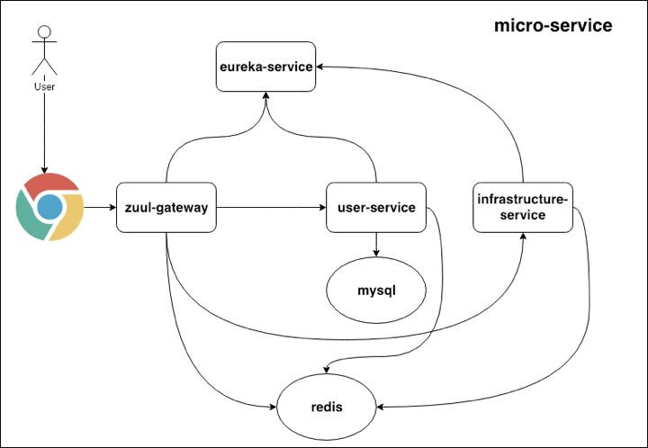

# micro-service
实现自动化部署的微服务

架构设计图

**如何在本地运行micro-service服务**

1、确保项目依赖的mysql已经启动，注意mysql是使用的docker启动的，端口是3307
2、确保redis已经启动，注意redis的端口是6378  使用redis-server redis_6378.conf&  可以启动
3、确保harbor私有仓库已经启动，可以在/Users/wangquanzhou/soft/harbor目录下使用docker-compose up -d命令启动
4、执行项目跟目录下的build.sh打包项目  并进行推送
5、项目根目录下执行docker-compose up -d启动项目
6、使用192.168.199.219:5050/email/send/wangquanzhou666@126.com/6可以发生邮件
7、172.16.59.128:8080/login?userName=audi234&email=wangquanzhou666@163.com&pwd=123456可以登录  登录获得的token可以进行查询用户信息操作